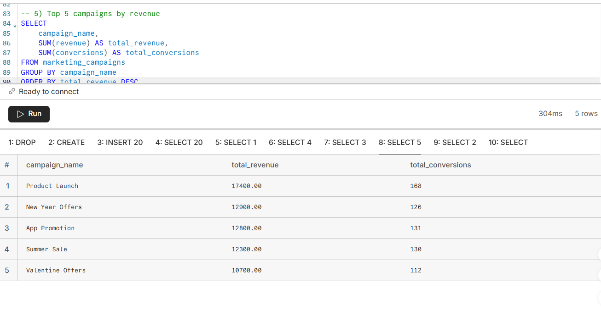

# 📊 Marketing Campaign Performance Analysis

## Overview

This project analyzes a marketing campaign dataset using PostgreSQL on Neon.

The objective is to evaluate campaign performance, compare marketing channels, and identify opportunities to improve return on investment (ROI).

---

## Tools

- PostgreSQL
- SQL
- Neon Database
- GitHub

---

## Dataset

The dataset contains marketing campaign information, including:

- Campaign Name

- Marketing Channel

- Country

- Device

- Marketing Spend

- Impressions

- Clicks

- Conversions

- Revenue

> This is a synthetic dataset created for learning and portfolio purposes.

---

## Business Questions

- Which marketing channel generated the highest revenue?

- Which country achieved the highest revenue?

- Which campaign generated the most conversions?

- Which device performed better?

- Which marketing channel had the highest ROI?

\---

## SQL Skills Demonstrated

- CREATE TABLE

- INSERT INTO

- SELECT

- WHERE

- GROUP BY

- ORDER BY

- Aggregate Functions (SUM, AVG)

- Calculated Metrics (ROI \& Conversion Rate)

---

## Key Findings

- Google Ads generated the highest revenue.

- Mobile campaigns showed strong performance.

- Marketing performance varied across countries.

- SQL queries helped identify the best-performing campaigns.

---

## Project Structure

marketing-campaign-sql-analysis

│

├── marketing\_analysis.sql

├── marketing\_campaign\_data.csv

└── README.md

## Results Preview

### Revenue and ROI by Marketing Channel

The following query calculates the total marketing spend, total revenue, total profit, and ROI percentage for each marketing channel.

*Key Insight:*
Instagram achieved the highest ROI, followed by Google Ads, while LinkedIn had the lowest ROI among the analyzed channels.

### Top 5 Campaigns by Revenue

This query identifies the five highest-performing marketing campaigns based on total revenue and total conversions.

*Key Insight:* Product Launch generated the highest revenue, followed by New Year Offers.

## Author

*Alaa Bakr*

Data Analyst

